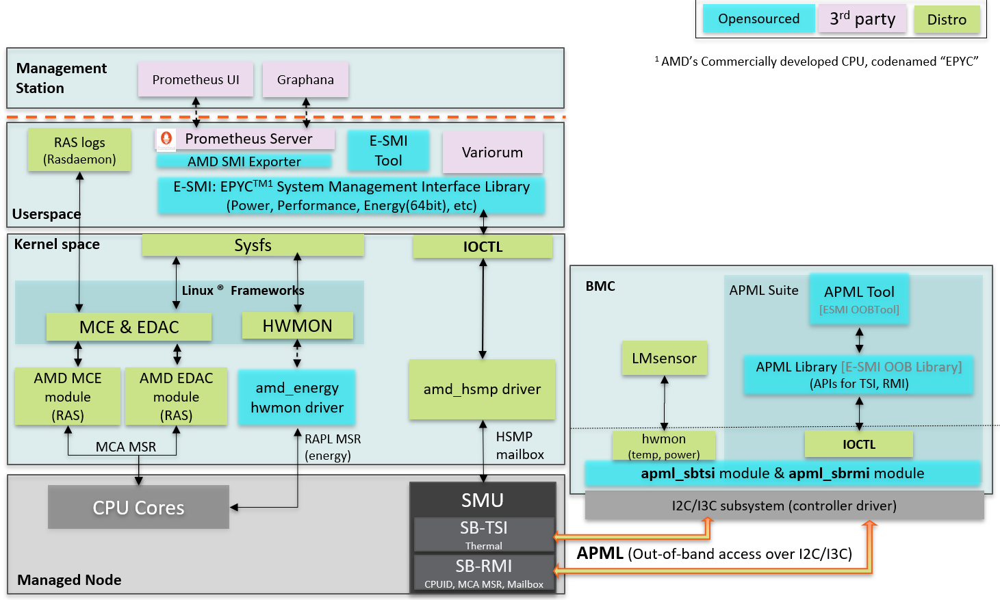

..
   # Copyright 2019-2022 Lawrence Livermore National Security, LLC and other
   # Variorum Project Developers. See the top-level LICENSE file for details.
   #
   # SPDX-License-Identifier: MIT

##############
 AMD Overview
##############

AMD platforms support in-band monitoring and control through sensors and
machine-specific registers for CPUs as well as GPUs. AMD provides and
open-source stack of its drivers as well as its in-band libraries that Variorum
leverages.

***************************
 Requirements for AMD CPUs
***************************

Beginning with Variorum 0.5.0, AMD processors from the AMD EPYC Milan family
19h, models 0-Fh and 30h-3Fh are supported. The current port is also expected to
be supported on the upcoming AMD EPYC Genoa architecture. This functionality has
been tested on Linux distributions SLES15 and Ubuntu 18.04. This port depends on
the AMD open-sourced software stack components listed below:

#. EPYC System Management Interface In-band Library (E-SMI library) available at
   https://github.com/amd/esmi_ib_library
#. AMD Energy Driver https://github.com/amd/amd_energy
#. HSMP driver for power metrics https://github.com/amd/amd_hsmp

The E-SMI library provides the C API for user space application of the AMD
Energy Driver and the AMD HSMP modules.

The AMD Energy Driver is an out-of-tree kernel module that allows for core and
socket energy counter access through MSRs and RAPL via ``hwmon`` sys entries.
These registers are updated every millisecond and cleared on reset of the
system. Some registers of interest include:

-  Power, Energy and Time Units
      -  ``MSR_RAPL_POWER_UNIT/ C001_0299``: shared with all cores in the socket

-  Energy consumed by each core
      -  ``MSR_CORE_ENERGY_STATUS/ C001_029A``: 32-bitRO, Accumulator,
         core-level power reporting

-  Energy consumed by Socket
      -  ``MSR_PACKAGE_ENERGY_STATUS/ C001_029B``: 32-bitRO, Accumulator,
         socket-level power reporting, shared with all cores in socket

The Host System Management Port (HSMP) kernel module allows for *setting* of
power caps, boostlimits and PCIe access. It provides user level access to the
HSMP mailboxes implemented by the firmware in the System Management Unit (SMU).
AMD Power Control Knobs are exposed through HSMP via sysfs.

-  ``amd_hsmp/cpuX/``: Directory for each possible CPU
      -  ``boost_limit`` (RW): HSMP boost limit for the core in MHz

-  ``amd_hsmp/socketX/``: Directory for each possible socket
      -  ``boost_limit`` (WO): Set HSMP boost limit for the socket in MHz
      -  ``c0_residency`` (RO): Average % all cores are in C0 state
      -  ``cclk_limit`` (RO): Most restrictive core clock (CCLK) limit in MHz
      -  ``fabric_clocks`` (RO): Data fabric (FCLK) and memory (MCLK) in MHz
      -  ``fabric_pstate`` (WO): Set data fabric P-state, -1 for autonomous
      -  ``power`` (RO): Average socket power in milliwatts
      -  ``power_limit`` (RW): Socket power limit in milliwatts
      -  ``power_limit_max`` (RO): Maximum possible value for power limit in mW
      -  ``proc_hot`` (RO): Socket PROC_HOT status (1 = active, 0 = inactive)
      -  ``tctl`` (RO): Thermal Control value (not temperature)

We expect a similar software stack to be available on the upcoming El Capitan
supercomputer at Lawrence Livermore National Laboratory.

***************************
 Requirements for AMD GPUs
***************************

Beginning with Variorum 0.6.0, we support AMD Radeon Instinct GPUs with the help
of the Radeon Open Compute management (ROCm) stack. The Variorum AMD GPU port
currently requires `ROCm System Management Interface (ROCm-SMI) v5.1.0
<https://rocmdocs.amd.com/en/latest/index.html>`_, and supports various AMD GPUs
including (but not limited) to MI50, MI60, MI100, and MI200. Future versions on
ROCm-SMI are expected to be backward compatible, and upcoming AMD GPU hardware
for El Capitan supercomputer is expected to be supported through ROCm-SMI as
well.

******************************************
 Monitoring and Control Through E-SMI API
******************************************

Variorum interfaces with AMD's E-SMI library for obtaining power and energy
information. These E-SMI APIs are described below.

The built-in monitoring interface on the AMD EPYC™ processors is implemented by
the SMU FW. All registers are updated every 1 millisecond.

Power telemetry
===============

-  ``esmi_socket_power_get()``: Instantaneous power is reported in milliwatts
-  ``esmi_socket_power_cap_get()`` and ``esmi_socket_power_cap_set()``: Get and
   Set power limit of the socket in milliwatts
-  ``esmi_socket_power_cap_max_get()``: Maximum Power limit of the socket in
   milliwatts

Boostlimit telemetry
====================

Boostlimit is a maximum frequency a CPU can run at.

-  ``esmi_core_boostlimit_get()`` and ``esmi_core_boostlimit_set()``: Get and
   set the current boostlimit for a given core
-  ``esmi_socket_boostlimit_set()``: Set boostlimit for all the cores in the
   socket

Energy telemetry
================

-  ``esmi_socket_energy_get()``: Get software accumulated 64-bit energy counter
   for a given socket
-  ``esmi_core_energy_get()``: Get software accumulated 64-bit energy counter
   for a given core

Details of the AMD E-SMS CPU stack can be found on the `AMD Developer website
<https://developer.amd.com/e-sms/>`_. We reproduce a figure from this stack
below.

*********************************************
 Monitoring and Control Through ROCM-SMI API
*********************************************

Variorum interfaces with AMD's ROCm-SMI library for obtaining power and energy
information for GPUs. These ROCm-SMI APIs are described below.

-  ``rsmi_num_monitor_devices``: Get the number of GPU devices.

-  ``rsmi_dev_power_ave_get``: Get the current average power consumption of a
   GPU device over a short time window in microwatts.

-  ``rsmi_dev_power_cap_get``: Get the current power cap in microwatts on a GPU
   device which, when reached, causes the system to take action to reduce power.

-  ``rsmi_dev_power_cap_range_get``: Get the range of valid values for the power
   cap, including the maximum possible and the minimum possible cap on a GPU
   device.

-  ``rsmi_dev_temp_metric_get``: Get the temperature metric value for the
   specified metric and sensor (e.g. Current or Max temperature), from the GPU
   device.

-  ``rsmi_dev_gpu_clk_freq_get``: Get the list of possible system clock speeds
   for a GPU device for a specified clock type (e.g. Graphics or Memory clock).

-  ``rsmi_utilization_count_get``: Get coarse grain utilization counter of the
   specified GPU device, including graphics and memory activity counters.

************
 References
************

-  `AMD EPYC processors Fam19h technical reference
   <https://www.amd.com/system/files/TechDocs/55898_B1_pub_0.50.zip>`_
-  `AMD ROCm-SMI technical reference
   <https://github.com/RadeonOpenCompute/rocm_smi_lib/blob/master/rocm_smi/docs/ROCm_SMI_Manual.pdf>`_
