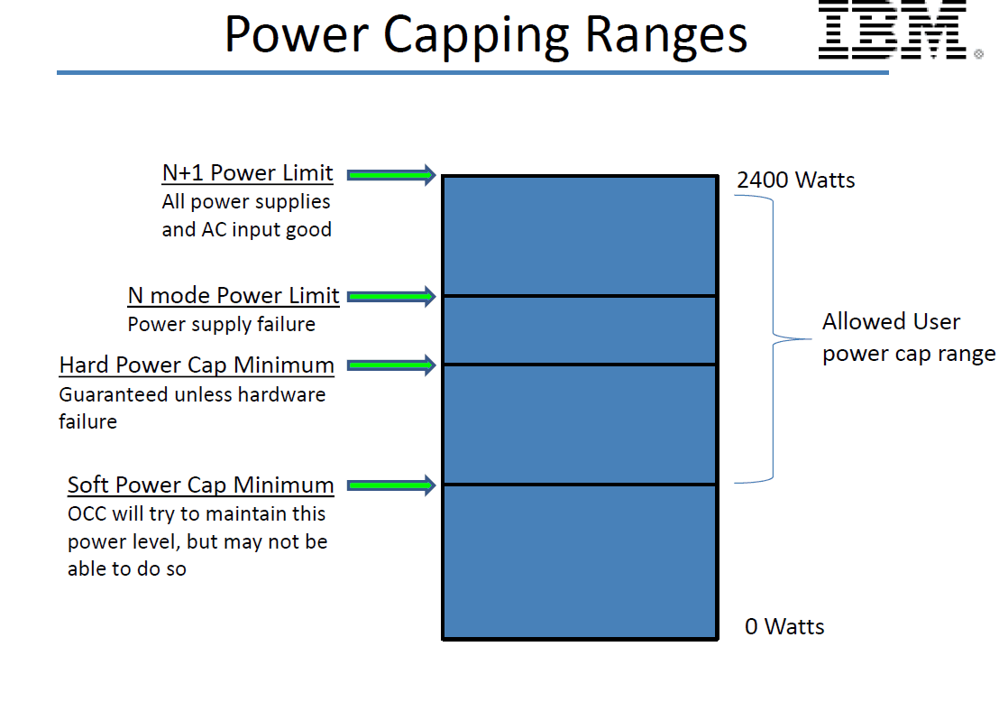

.. # Copyright 2019 Lawrence Livermore National Security, LLC and other
.. # Variorum Project Developers. See the top-level LICENSE file for details.
.. #
.. # SPDX-License-Identifier: MIT

IBM Power9 Overview
===================

IBM Power9 architecture supports in band monitoring with sensors and out of
band power capping with OPAL. These depend on specific IBM files that we
describe below. Permissions on these files can be modified through cgroups.
OPAL/Skiboot is part of IBM provided firmware that is expected to be present on
the system.

References:

* `OCC <https://github.com/open-power/docs/blob/master/occ/OCC_P9_FW_Interfaces.pdf>`_
* `OPAL <https://openpowerfoundation.org/wp-content/uploads/2015/03/Smith-Stewart_OPFS2015.intro-to-OPAL.031715.pdf>`_
* `Skiboot <https://github.com/open-power/skiboot1>`_
* `Inband Sensors <https://github.com/shilpasri/inband_sensors>`_

Inband Sensors for Monitoring
-----------------------------

The OCC (On-Chip-Controller) periodically reads various sensors related to
power, temperature, CPU frequency, CPU utilization, memory bandwidth, etc. The
sensor data is stored in OCC's SRAM and is available to the user inband through
the sensors file listed below:

* Key file for inband sensors: `/sys/firmware/opal/exports/occ_inband_sensors`

OCC Sensor Data formatting is described below, and we then describe the code
structures that were used to represent this data in the IBM port of Variorum.

OCC Sensor Data
---------------

OCC sensor data will use BAR2 (OCC Common is per physical drawer). Starting
address is at offset 0x00580000 from BAR2 base address. Maximum size is 1.5MB.

===================================== ========== ===== =========================
Start (Offset from BAR2 base address) End        Size  Description
===================================== ========== ===== =========================
0x00580000                            0x005A57FF 150kB OCC 0 Sensor Data Block
0x005A5800                            0x005CAFFF 150kB OCC 1 Sensor Data Block
:                                     :          :     :
0x00686800                            0x006ABFFF 150kB OCC 7 Sensor Data Block
0x006AC000                            0x006FFFFF 336kB Reserved
===================================== ========== ===== =========================

OCC N Sensor Data Block Layout (150kB)
--------------------------------------

The sensor data block layout is the same for each OCC N. It contains
sensor-header-block, sensor-names buffer, sensor-readings-ping buffer and
sensor-readings-pong buffer.

=========================================== ========== ===== ===========================
Start (Offset from OCC N Sensor Data Block) End        Size  Description
=========================================== ========== ===== ===========================
0x00000000                                  0x000003FF 1kB   Sensor Data Header Block
0x00000400                                  0x0000CBFF 50kB  Sensor Names
0x0000CC00                                  0x0000DBFF 4kB   Reserved
0x0000DC00                                  0x00017BFF 40kB  Sensor Readings ping buffer
0x00017C00                                  0x00018BFF 4kB   Reserved
0x00018C00                                  0x00022BFF 40kB  Sensor Readings pong buffer
0x00022C00                                  0x000257FF 11kB  Reserved
=========================================== ========== ===== ===========================

There are eight OCC Sensor Data Blocks. Each of these has the same data block
layout. Within each sensor data block, we have:

* **data header block**: Written once at initialization, captured in occ_sensor_data_header struct (reading_version in this struct defines the format of the ping/pong buffer, this could be READING_FULL or READING_COUNTER).
* **names block**: Written once at initialization, captured in occ_sensors_name
* **readings ping buffer and readings pong buffer**: The ping/pong buffers are two 40kB buffers, one is being updated by the OCC and the other is available for reading. Both have the same format version (defined in sensor_struct_type and struct_attr).

There are four enums:

1. **occ_sensor_type**: e.g., CURRENT, VOLTAGE, TEMPERATURE, POWER, etc.
2. **occ_sensor_location**: e.g., SYSTEM, PROCESSOR, MEMORY, CORE, etc.
3. **sensor_struct_type**: READING_FULL, READING_COUNTER (ties to reading_version)
4. **sensor_attr**: SAMPLE, ACCUMULATOR (also has to do with reading_version)

There are four structs:

1. **occ_sensor_data_header**: Gives us offsets to ping and pong buffers, format version of the ping and pong buffers (reading_version), and offset to location of the names buffer.
2. **occ_sensor_name**: Format of the sensor. Gives us the type of sensor, location of sensor, name of sensor, unit of sensor, update frequency of sensor, format of ping/pong buffer of that particular sensor, offset for reading buffers for this particular sensor.
3. **occ_sensor_record**: This is the data if you were using READING_FULL.  Contains timestamp, latest sample or latest accumulated value, min and max values for sample, job scheduler, profiler and CSM (we're not clear about what these are). We think the sample one is the interesting one for our purpose at the moment.
4. **occ_sensor_counter**: This is the data if you were using READING_COUNTER. Contains timestamp, latest sample or latest accumulated value.  unit_8 values and no min/max values are reported here.

Out of Band Power Capping and GPU Shifting Ratio
-------------------------------------------------

Power caps and GPU power shifting ratio can be set by using OPAL/Skiboot. This
is an out of band interface.

Node power caps are set by writing to the following file in watts:
`/sys/firmware/opal/powercap/system-powercap/powercap-current`

Socket level power capping is not available.

GPU power shifting ratio can be set by setting the following files in
percentage (i.e., between 0 and 100).
`/sys/firmware/opal/psr/cpu_to_gpu_0` and
`/sys/firmware/opal/psr/cpu_to_gpu_8`

Write access to these files is needed to set node power caps and GPU ratio.

The figure below depicts the ranges for IBM power caps on Power9 system.

The figure below shows the details of GPU power shifting ratio.

..  image:: images/IBM_GPUPowerShiftingRatio.png
    :height: 300px
    :align: center
