.. # Copyright 2019-2020 Lawrence Livermore National Security, LLC and other
.. # Variorum Project Developers. See the top-level LICENSE file for details.
.. #
.. # SPDX-License-Identifier: MIT

Intel Overview
==============

Intel processors have the most sophisticated power and thermal control of any
processor vendor we work with. While Intel's documentation remains the final
arbiter, that format has not allowed the community of Intel users to discuss
best practices and distribute documentation patches. For this release we provide
below a listing of the MSRs found in Chapter 14 of volume 3B of Intel's SDM,
plus a few related MSRs that exist elsewhere in public documentation. Alongside
the register diagrams we note what we have learned (if anything) by using the
registers and discussing them with our colleagues at Intel and elsewhere.

Best Practices
--------------

These are the most common mistakes we have seen when using these registers.

* IA32_PERF_CTL does not set clock frequency
        * In the distant pass prior to multicore and turbo, setting IA32_PERF_CTL
          might have had the effect of dialing in the requested CPU clock frequency.
          In any processor since Nehalem, however, it sets a frequency cap.

* Always measure effective clock frequency using IA32_APERF and IA32_MPERF.
        * Given the amount of performance variation within the operating system
          and within and across processors, it is easy to talk oneself into a
          story of how a particular knob relates to performance by changing the
          clock frequency. Measuring both execution time and clock frequency
          (and perhaps IPC as well) is an excellent filter for those stories.

* Do not use Linux performance governors.
        * They do very little and what little they do they do badly.

* Not all encodable values are effective.
        * The canonical case here is RAPL time windows. There is a minimum
          value supported in firmware, and any request for less than that
          minimum is silently clipped.

Caveats
-------

* Intel naming conventions are often inconsistent.
        * Naming conventions will vary across and within documents, even to
          the naming of particular MSRs. While these are trivial to the
          eye (CTL versus CONTROL, PKG versus PACKAGE) it does make grepping
          documents more challenging that it should be. We have tried to
          follow a consistent scheme for MSRs, PCI addresses and CPUID
          queries. Where there is a conflict in MSR names, we have chosen
          what seems most sensible.

* Determining which MSRs are available on which processors is problematic.
        * Motherboard manufacturers can mask out available MSRs, and Intel's
          documentation can contain errors.

* We welcome patches.
        * rountree@llnl.gov

Enhanced Intel Speedstep Technology
-----------------------------------

* Exists if CPUID.(EAX=1):ECX[7] == 1.
* Enabled by IA32_MISC_ENABLE[16] <- 1.
* MSRs used:
        * IA32_PERF_CTL
        * IA32_PERF_STATUS
        * IA32_PM_ENABLE
        * MSR_PLATFORM_INFO

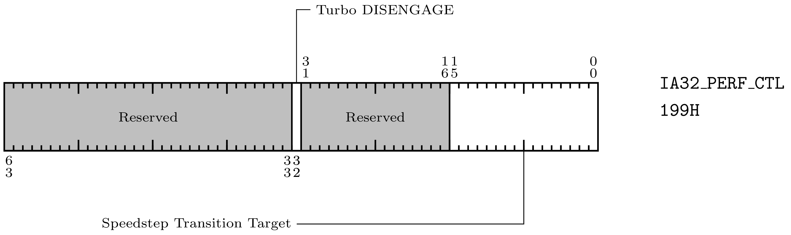
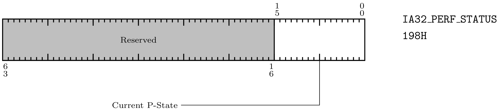
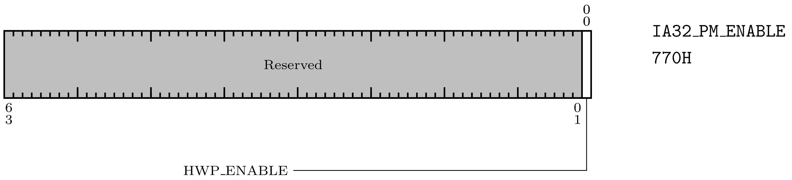

* IA32_PM_ENABLE will disable IA32_PERF_CTL. The enable bit is sticky and requires a reset to clear.

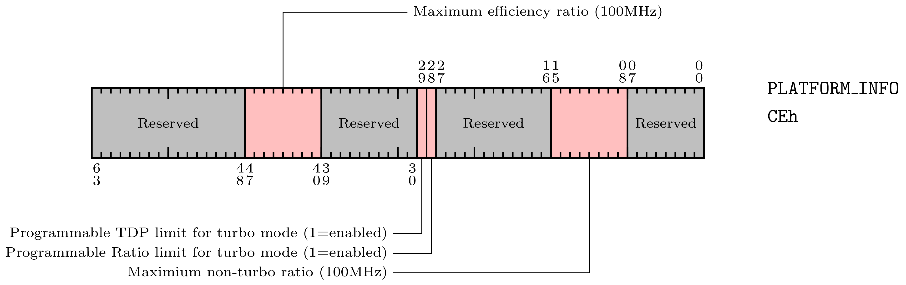

* MSR_PLATFORM_INFO Maximum Efficiency Ratio is the only guaranteed frequency regardless of workload.

P-State Hardware Coordination
-----------------------------

* Exists if CPUID.(EAX=6):ECX[0] == 1
* MSRs used:
        * IA32_MPERF
        * IA32_APERF

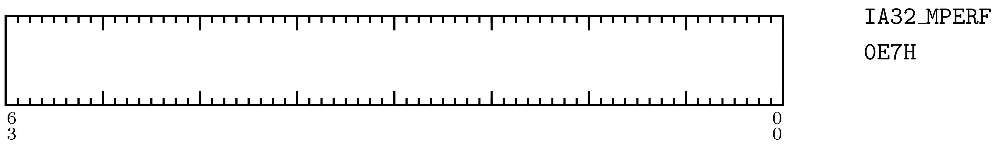
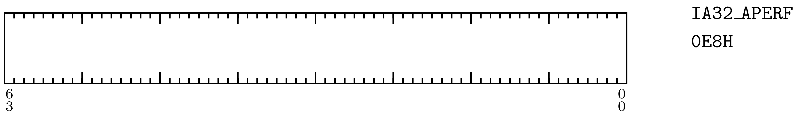

Intel Dynamic Acceleration Technology/Intel Turbo Boost Technology
------------------------------------------------------------------

* Enabled by MSR_MISC_ENABLE[38] <- 1, IA32_PERF_CTL[32] <- 0
* Note that the former is intended for one-time use by BIOS, the latter is intended for dynamic control.

Performance and Energy Bias Hint Support
----------------------------------------
* Exists if CPUID.(EAX=6):ECX[3] == 1
* MSRs used:
        * IA32_ENERGY_PERF_BIAS

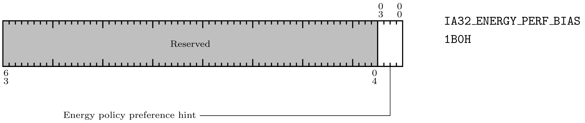

Hardware Controlled Performance States
--------------------------------------

* If CPUID.(EAX=6):EAX[7] == 1, then IA32_PM_ENABLE, IA32_HWP_CAPABILITIES, IA32_HWP_REQUEST, IA32_HWP_STATUS present.
* If CPUID.(EAX=6):EAX[8] == 1, then IA32_HWP_INTERRUPT present.
* If CPUID.(EAX=6):EAX[9] == 1, then IA32_HWP_REQUEST contains a programmable activity window.
* If CPUID.(EAX=6):EAX[10]== 1, then IA32_HWP_REQUEST has a programmable energy/performance hint.
* If CPUID.(EAX=6):EAX[11]== 1, then IA32_HWP_REQUEST_PKG is present.
* If CPUID.(EAX=6):EAX[20]== 1 and a single logical processor of a core is active, requests originating in the idle virtual processor via IA32_HWP_REQUEST_MSR are ignored.
* If CPUID.(EAX=6):EAX[18]== 1, IA32_HWP_REQUEST writes become visible outside the originating logical processor via "fast writes."

* MSRs used:
        * IA32_PM_ENABLE
        * IA32_HWP_CAPABILITIES
        * IA32_HWP_REQUEST_PKG
        * IA32_HWP_INTERRUPT
        * IA32_HWP_REQUEST
        * IA32_HWP_PECI_REQUEST_INFO
        * IA32_HWP_STATUS
        * IA32_THERM_STATUS
        * MSR_PPERF
        * FAST_UNCORE_MSRS_CAPABILITY
        * FAST_UNCORE_MSRS_CTL
        * FAST_UNCORE_MSRS_STATUS

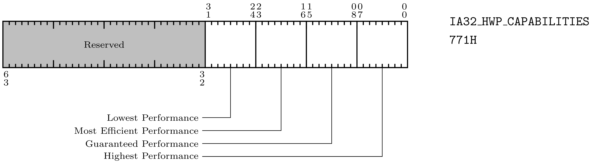
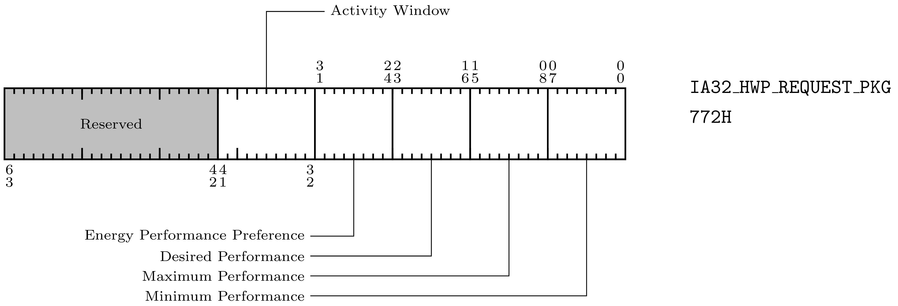
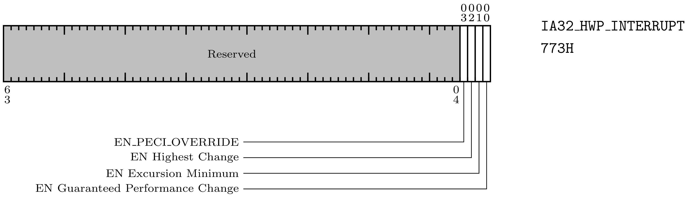
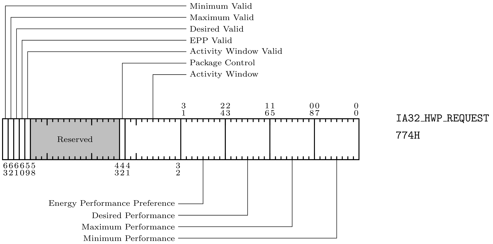
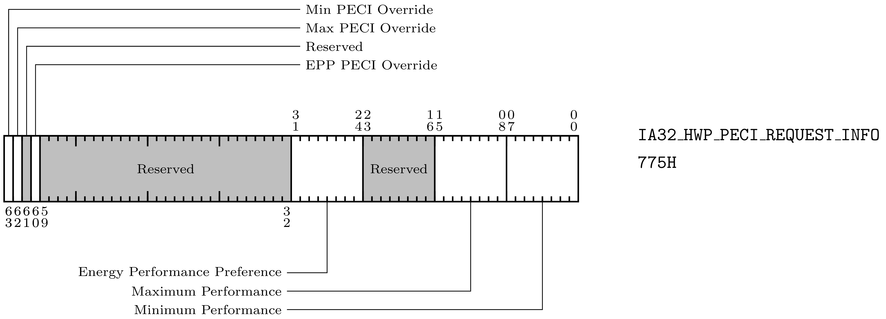
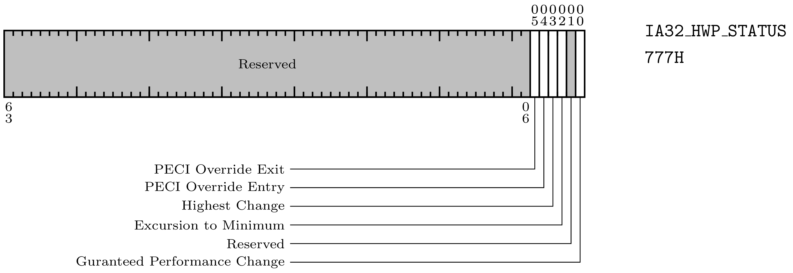
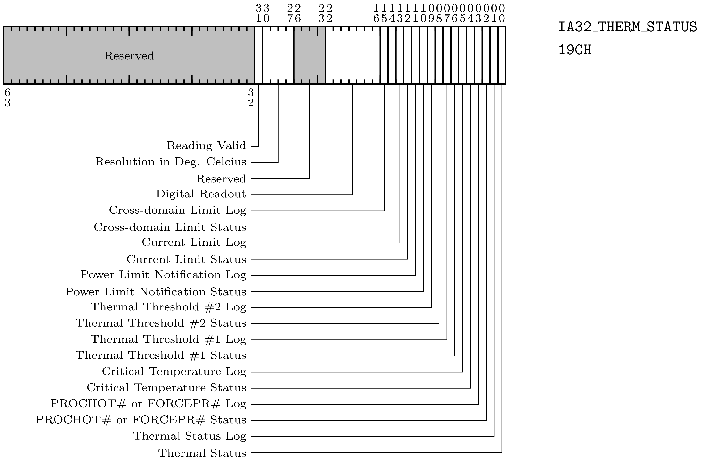
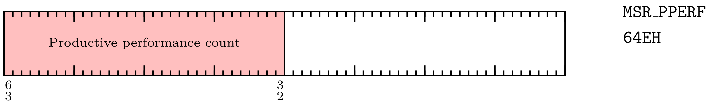
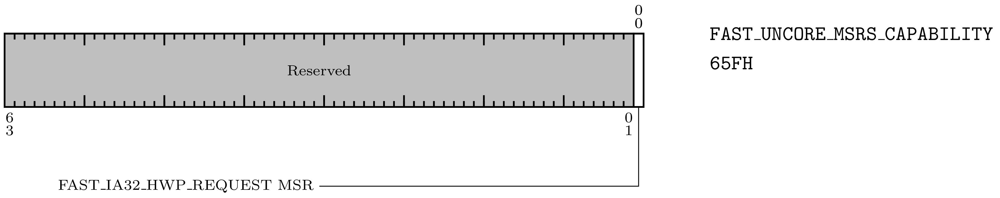
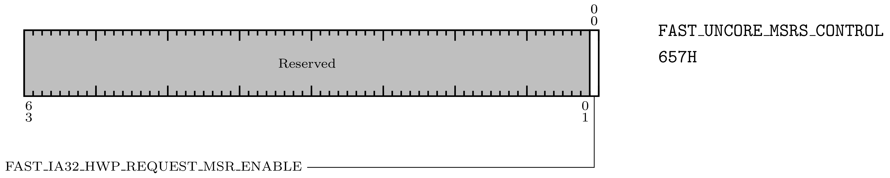
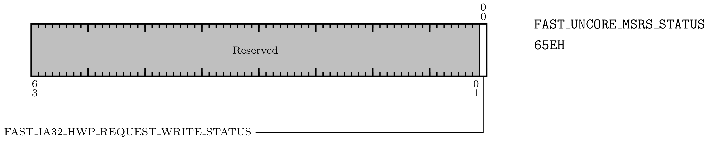

Hardware Duty Cycling
---------------------

* Present if CPUID.(EAX=6):EAX[13] == 1
* MSRs used:
        * IA32_PKG_HDC_CTL
        * IA32_PM_CTL1
        * IA32_THREAD_STALL
        * MSR_CORE_HDC_RESIDENCY
        * MSR_PKG_HDC_SHALLOW_RESIDENCY
        * MSR_PKG_HDC_DEEP_RESIDENCY
        * MSR_PKG_HDC_CONFIG

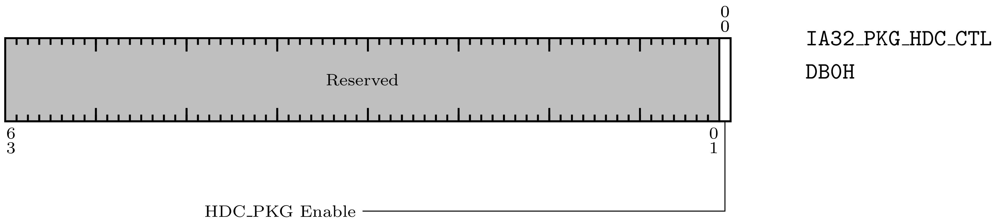
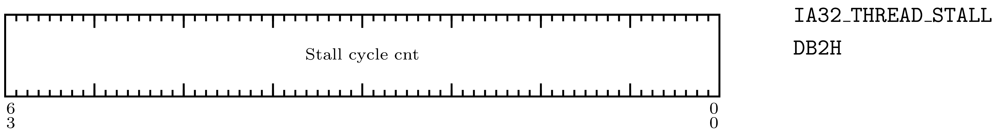

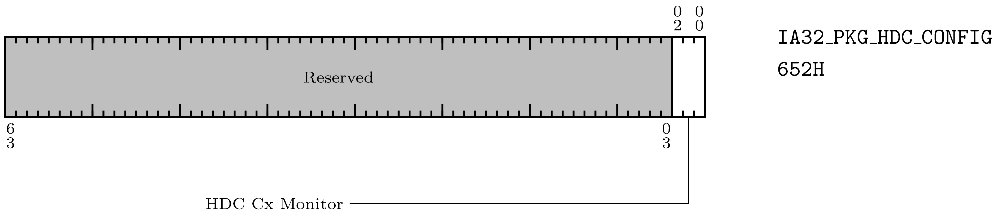

Thermal Monitoring and Protection
---------------------------------

* TM1 present if CPUID.(EAX=1):EDX[29] == 1, enabled by IA32_MISC_ENABLE[3]
* TM2 present if CPUID.(EAX=1):ECX[8] == 1, enabled by IA32_MISC_ENABLE[13]
* Digital Thermal Sensor Enumeration present if CPUID.(EAX=0):EAX[0]=1

* MSRs used
        * MSR_THERM2_CTL
        * IA32_THERM_STATUS
        * IA32_THERM_INTERRUPT
        * IA32_CLOCK_MODULATION
        * IA32_THERM_STATUS

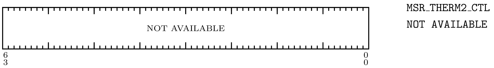

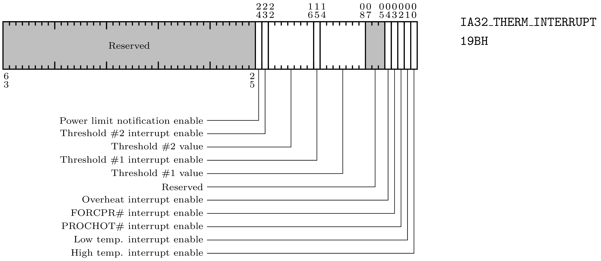
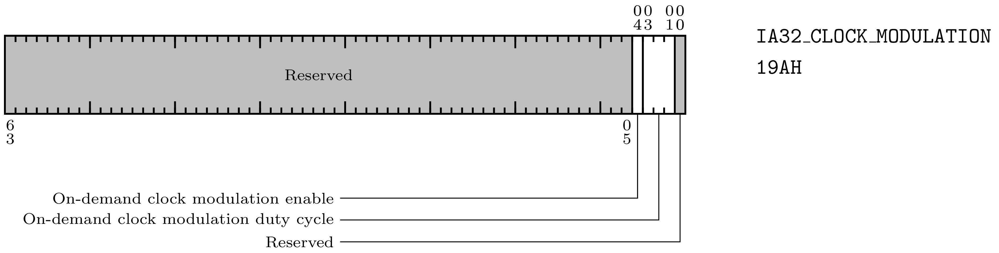

Package Level Thermal Management
--------------------------------

* Present if CPUID.(EAX=6):EAX[6] == 1

* MSRs used
        * IA32_PACKAGE_THERM_STATUS
        * IA32_PACKAGE_THERM_INTERRUPT

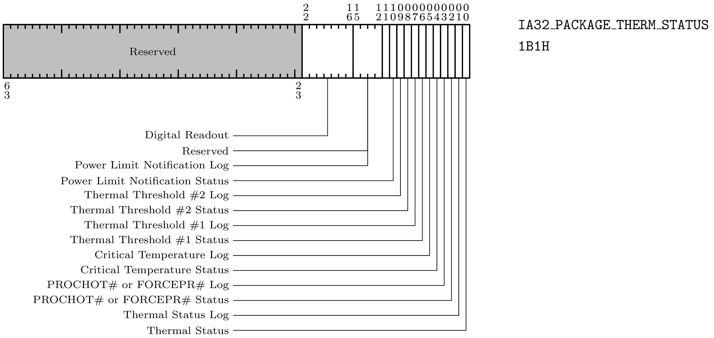
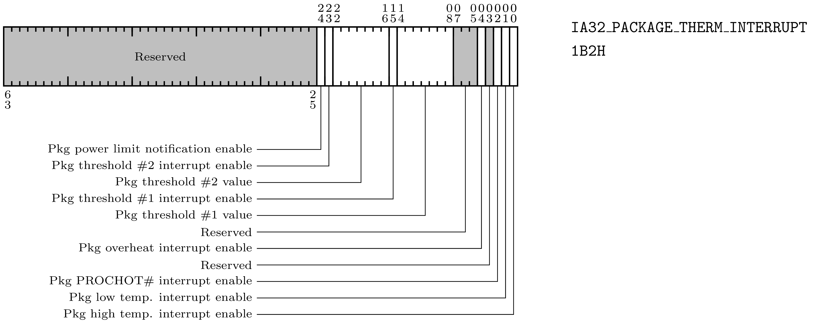

Platform Specific Power Management Support
------------------------------------------

* MSRs used
        * MSR_PKG_POWER_LIMIT
        * MSR_PKG_ENERGY_STATUS
        * MSR_PKG_PERF_STATUS
        * MSR_PKG_POWER_INFO
        * MSR_DRAM_POWER_LIMIT
        * MSR_DRAM_ENERGY_STATUS
        * MSR_DRAM_PERF_STATUS
        * MSR_DRAM_POWER_INFO
        * MSR_PP0_POWER_LIMIT
        * MSR_PP0_ENERGY_STATUS
        * MSR_PP0_POLICY
        * MSR_PP0_PERF_STATUS
        * MSR_PP1_POWER_LIMIT
        * MSR_PP1_ENERGY_STATUS
        * MSR_PP1_POLICY

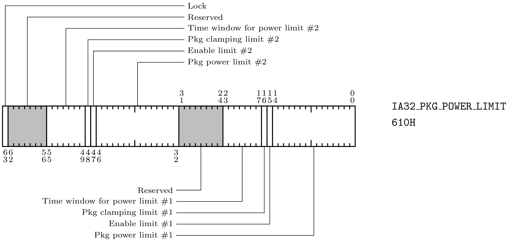

* The two different power limits use different algorithms and are intended for use across different timescales. The details are still NDA.
* There is a lower limit to the time windows. Values below that will be silently clipped. That value is also NDA.
* The OS and enable bits are now ignored. Both of them should always be set high. Writing all-zeros to this register will not disable RAPL; the processor will just try to meet a zero-watt power bound (or whatever zero is clipped to.)

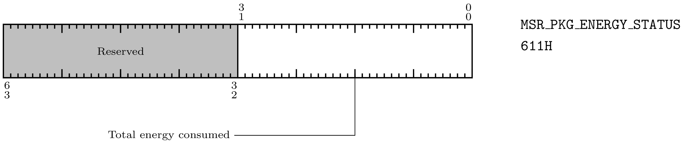
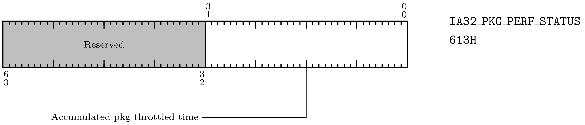
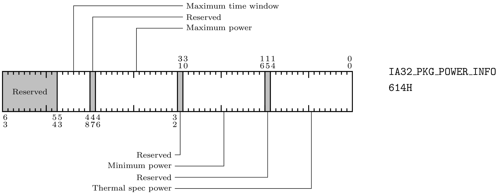
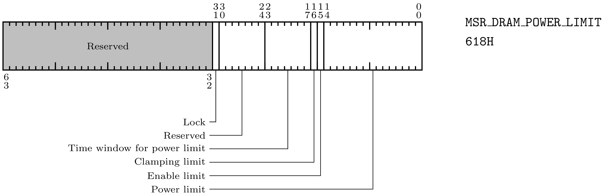

* The DRAM power controls have not proven to be that useful. If a program is not generating much memory traffic, not much power is used. Programs that do generate lots of memory traffic have outsized slowdown if memory power is restricted.

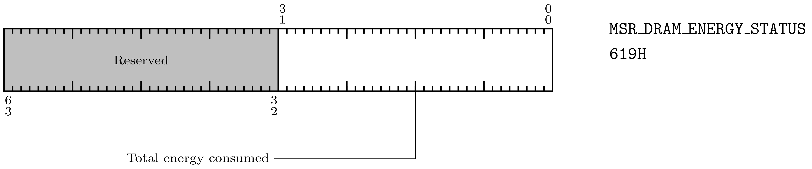
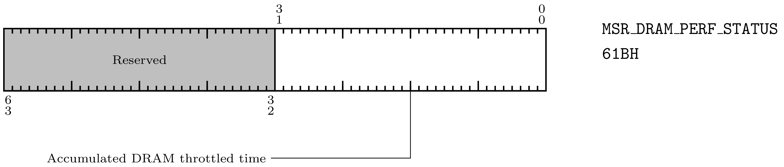
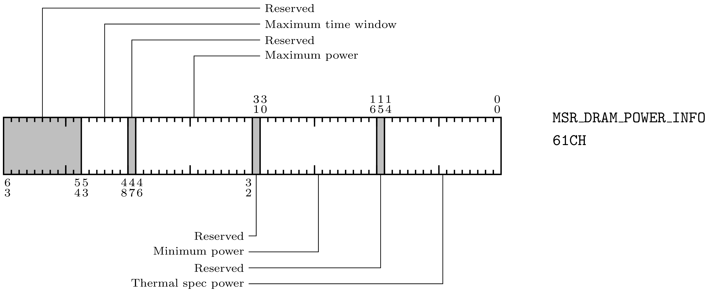
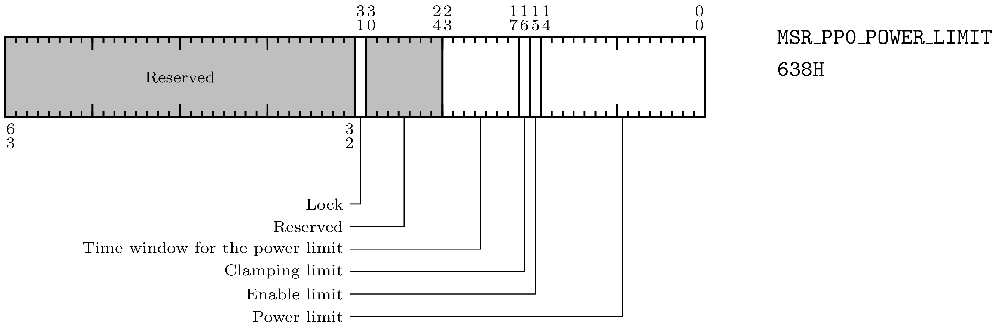

* PP0 power control has been unofficially deprecated.

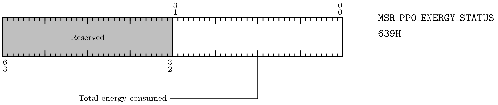
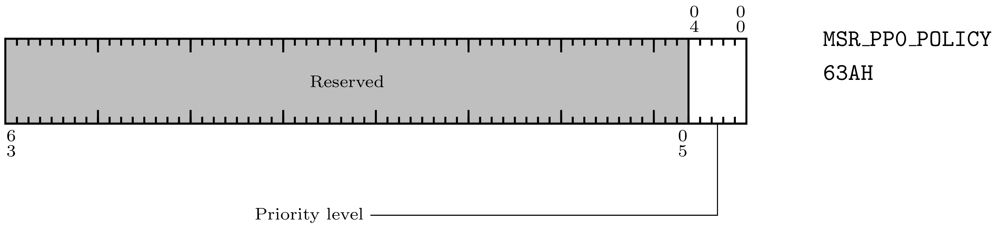
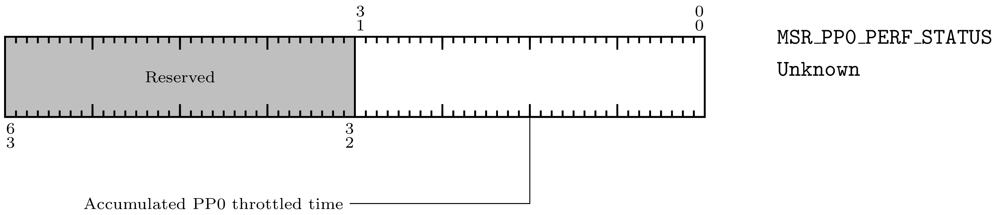

* PP1 power control was intended for client processors and has not been investigated in the HPC community.

Other Public MSRs of Interest
-----------------------------

        * MSR_POWER_CTL

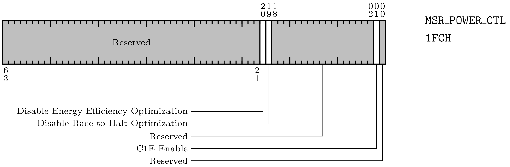
