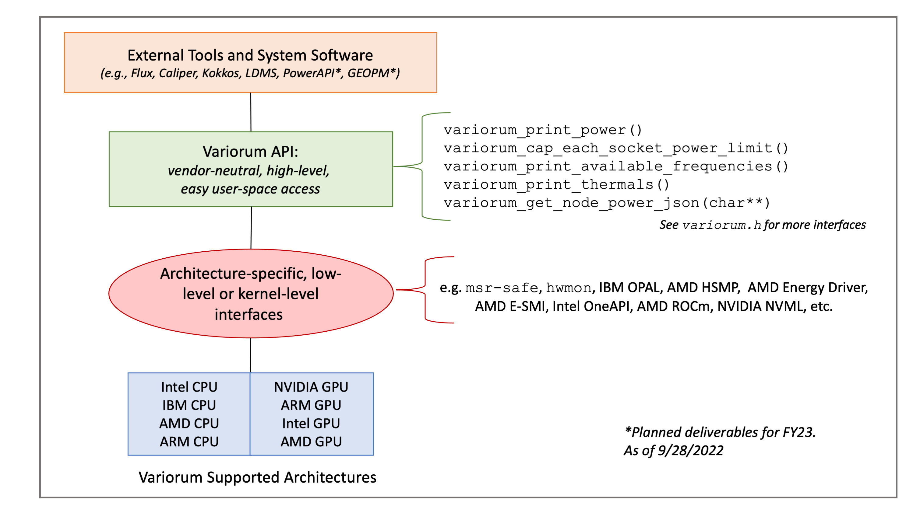

.. # Copyright 2019 Lawrence Livermore National Security, LLC and other
.. # Variorum Project Developers. See the top-level LICENSE file for details.
.. #
.. # SPDX-License-Identifier: MIT

Variorum Overview
=================

Variorum is an evolution of an existing open-source library developed at LLNL
known as ``libmsr``. Variorum is a production-grade software infrastructure for
exposing low-level control and monitoring of a system's underlying hardware
features. It can easily be ported to different hardware devices, as well as
different generations within a particular device. More specifically, Variorum's
flexible design supports a set of features that may exist on one generation of
hardware, but not on another.

Requirements
------------

To guide the development of Variorum, we focused on a set of important
requirements extracted from our learnings with the development of ``libmsr``.
Here are Variorum's requirements:

* **Create device-agnostic APIs**: We do not want to require the user to have to
  know or understand how to interface with each device. The library is built
  for a target architecture, which may be heterogeneous, and can collect data
  from each device through a single front-facing interface.

* **Provide a simple interface**: We want users and tool developers to not only
  collect information from the underlying hardware, but also to have the
  ability to control various features.

* **Ease in extending to new devices and generations within a device**: Variorum
  makes it easy to support new features, deprecate old features among
  generations of devices, and adapt features that may have different domains of
  control from one generation to another (i.e., sockets, cores, threads).

System Diagram
--------------

Dependencies
------------

This section describes Variorum's key dependencies.

hwloc (Required)
""""""""""""""""
`hwloc <https://www.open-mpi.org/projects/hwloc/>`_ is an open-source project
providing a portable abstraction of the hierarchical topology of modern
architectures.

Variorum leverages hwloc for detecting hardware topology. When reading/writing
a register on a particular hardware thread, hwloc can map that to the correct
physical socket.
