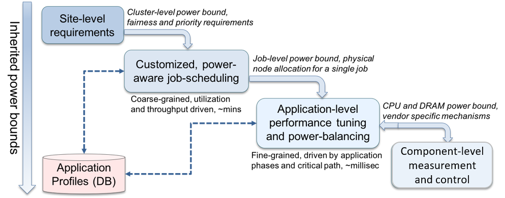

..
   # Copyright 2019-2023 Lawrence Livermore National Security, LLC and other
   # Variorum Project Developers. See the top-level LICENSE file for details.
   #
   # SPDX-License-Identifier: MIT

###########################
 HPC PowerStack Initiative
###########################

The HPC PowerStack Initiative brings together experts from academia, research
laboratories and industry in order to design a holistic and extensible power
management framework, which we refer to as the PowerStack. The PowerStack
explores hierarchical interfaces for power management at three specific levels:
batch job schedulers, job-level runtime systems, and node-level managers. The
HPC PowerStack community meets regularly, details of which can be found at their
`website <https://hpcpowerstack.github.io>`_.

The :doc:`Argo` is one of the key contributors to the HPC PowerStack Initiative.
HPC PowerStack also closely collaborates with the following community efforts:

.. toctree::
   :maxdepth: 2

   PowerAPI
   EEHPC

Each level in the PowerStack will provide options for adaptive and dynamic power
management depending on requirements of the supercomputing site under
consideration, and would be able to operate as an independent entity if needed.
Site-specific requirements such as cluster-level power bounds, user fairness, or
job priorities will be translated as inputs to the job scheduler. The job
scheduler will choose power-aware scheduling plugins to ensure compliance, with
the primary responsibility being management of allocations across multiple users
and diverse workloads. Such allocations (physical nodes and job-level power
bounds) will serve as inputs to a fine-grained, job-level runtime system to
manage specific application ranks, in-turn relying on vendor-agnostic node-level
measurement and control mechanisms.

The figure below presents an overview of the envisioned PowerStack, which takes
a holistic approach to power management. Variorum is a reference example that
represents the vendor-agnostic node-level interface, which can integrate with
high-levels in the PowerStack as and when needed, which we describe in
:doc:`VariorumTools`.

